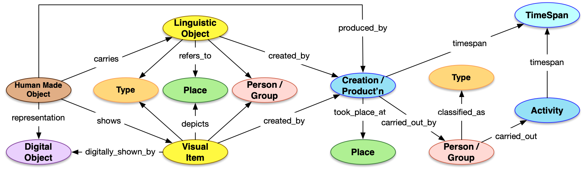

# Content and carriers

In Linked Art, record-level entities are divided into two categories:

-   Conceptual entities, which represent the intellectual content of a resource:

    -   `DigitalObject`

    -   `LinguisticObject`

    -   `Set`

    -   `VisualItem`

-   Carrier entities, which carry that content in a particular form:

    -   `DigitalObject`

    -   `HumanMadeObject`


**Note:** Digital objects are a special case because they can function as both conceptual entities and content carriers, depending on the context.

Resources with a base class of `LinguisticObject` or `VisualItem` must follow the content/carrier model. In MARC-based systems, this model corresponds roughly to the distinction between bibliographic records and holdings records.

For each record-level resource with a base class of `LinguisticObject` or `VisualItem` \(the *content* level\), one or more resources with a base class of `HumanMadeObject` \(the *carrier* level\) must be generated.

These `HumanMadeObject` resources must point to the `LinguisticObject` or `VisualItem` resource that they instantiate and where the supertype and any subjects, etc., are assigned.

The following diagram \(by Rob Sanderson\) provides a high-level overview of the Linked Art model.



## Processing steps and output

1.  For each MARC bibliographic record, determine the supertype of the resource and generate a JSON-LD document with a `type` value corresponding to the base class of the supertype.

    **Note:** This example is meant to illustrate the content/carrier distinction and does not represent a complete JSON-LD document.

    ```
    {
      "@context": "https://linked.art/ns/v1/linked-art.json",
      "id": "https://lux.collections.yale.edu/data/text/416165c2-1108-4acd-b7ab-008f773a2ba3",
      "type": "LinguisticObject",
      "_label": "麗澤論說集錄 : [十卷]",
      "classified_as": [
        {
          "id": "http://vocab.getty.edu/aat/300028051",
          "type": "Type",
          "_label": "Books",
          "classified_as": [
            {
              "id": "http://vocab.getty.edu/aat/300226816",
              "type": "Type",
              "_label": "Format"
            }
          ]
        }
      ]
    }
    ```

2.  For each MARC holdings record attached to a bibliographic record, generate a JSON-LD document with a base class of `HumanMadeObject`.

3.  If the supertype of the resource corresponding to the bibliographic record has a base class of `LinguisticObject` or `VisualItem`, then the `HumanMadeObject` resource must point to the content-level resource using the `carries` property for `LinguisticObject` resources or the `shows` property for `VisualItem` resources.

    **Note:** This example is meant to illustrate the content/carrier distinction and does not represent a complete JSON-LD document.

    ```
    {
      "@context": "https://linked.art/ns/v1/linked-art.json",
      "id": "https://lux.collections.yale.edu/data/object/8e0bdbff-ebb1-4f9b-b98b-e97d64a01ff9",
      "type": "HumanMadeObject",
      "_label": "麗澤論說集錄 : [十卷]",
      "carries": [
        {
          "id": "https://lux.collections.yale.edu/data/text/416165c2-1108-4acd-b7ab-008f773a2ba3",
          "type": "LinguisticObject",
          "_label": "麗澤論說集錄 : [十卷]"
        }
      ]
    }
    ```


**Parent topic:**[Record-level entities](../concepts/record_level_entities.md)

**Next topic:**[LUX supertype taxonomy](../concepts/supertypes/supertypes.md)

