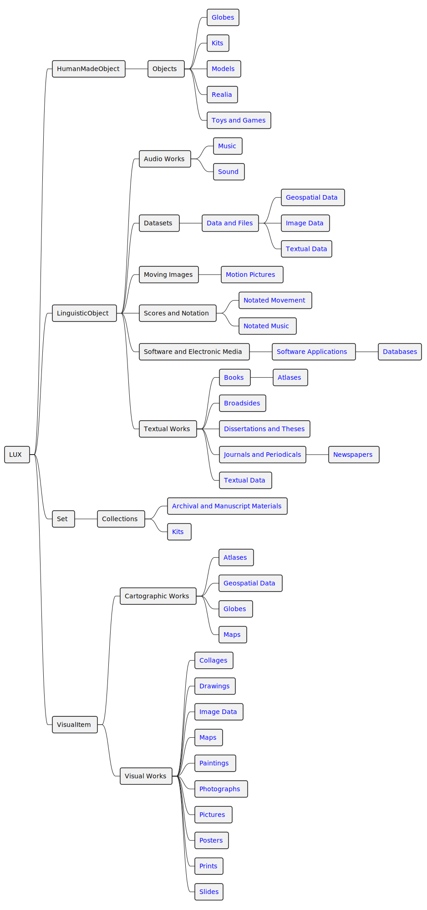

# LUX supertype taxonomy

Taxonomy of content types and related formats for classifying record-level resources in LUX.

Format mappings \(level one and level two\) are applied to carrier-level records \(`HumanMadeObject` or `DigitalObject`\). Content type mappings are inferred from format mappings and are applied to content-level records \(`LinguisticObject`, `VisualItem`, or `Set`\).

The supertype of a resource is used to determine its base class or document type in the Linked Art model.

**Note:** For supertypes that map to more than one base class, the primary class is indicated as **primary** in the base class column. However, a single base class document may have more than one content type assigned. For example, a `LinguisticObject` that is carried by a `HumanMadeObject` classified as `Maps` would be classified as both `Cartographic Works` and `Visual Works`.

|Base class|Content type|Format level one|Format level two|
|----------|------------|----------------|----------------|
|LinguisticObject|Audio Works|[Music](music.md)| |
|LinguisticObject|Audio Works|[Sound](sound.md)| |
|LinguisticObject|Cartographic Works|[Atlases](atlases.md)| |
|LinguisticObject|Cartographic Works|[Geospatial Data](geospatialdata.md)| |
|LinguisticObject|Cartographic Works|[Globes](globes.md)| |
|LinguisticObject **\[primary\]**|Cartographic Works|[Maps](maps.md)| |
|LinguisticObject **\[primary\]**|Datasets|[Data and Files](dataandfiles.md)|[Geospatial Data](geospatialdata.md)|
|LinguisticObject **\[primary\]**|Datasets|[Data and Files](dataandfiles.md)|[Image Data](imagedata.md)|
|LinguisticObject|Datasets|[Data and Files](dataandfiles.md)|[Textual Data](textualdata.md)|
|LinguisticObject|Moving Images|[Motion Pictures](motionpictures.md)| |
|LinguisticObject|Objects|[Globes](globes.md)| |
|LinguisticObject **\[primary\]**|Objects|[Kits](kits.md)| |
|LinguisticObject|Objects|[Models](models.md)| |
|LinguisticObject|Objects|[Realia](realia.md)| |
|LinguisticObject|Objects|[Toys and Games](toysandgames.md)| |
|LinguisticObject|Scores and Notation|[Notated Movement](notatedmovement.md)| |
|LinguisticObject|Scores and Notation|[Notated Music](notatedmusic.md)| |
|LinguisticObject|Software and Electronic Media|[Software Applications](softwareapplications.md)|[Databases](databases.md)|
|LinguisticObject|Textual Works|[Books](books.md)|[Atlases](atlases.md)|
|LinguisticObject|Textual Works|[Broadsides](broadsides.md)| |
|LinguisticObject|Textual Works|[Dissertations and Theses](dissertationsandtheses.md)| |
|LinguisticObject|Textual Works|[Journals and Periodicals](journalsandperiodicals.md)|[Newspapers](newspapers.md)|
|LinguisticObject|Textual Works|[Textual Data](textualdata.md)| |
|Set|Collections|[Archival and Manuscript Materials](archivalandmanuscriptmaterials.md)| |
|Set|Collections|[Kits](kits.md)| |
|VisualItem|Visual Works|[Collages](collages.md)| |
|VisualItem|Visual Works|[Drawings](drawings.md)| |
|VisualItem|Visual Works|[Image Data](imagedata.md)| |
|VisualItem|Visual Works|[Maps](maps.md)| |
|VisualItem|Visual Works|[Paintings](drawings.md)| |
|VisualItem|Visual Works|[Photographs](photographs.md)| |
|VisualItem|Visual Works|[Pictures](pictures.md)| |
|VisualItem|Visual Works|[Posters](posters.md)| |
|VisualItem|Visual Works|[Prints](prints.md)| |
|VisualItem|Visual Works|[Slides](slides.md)| |

## Content-type mapping

Map the content type classifications to the Getty URIs listed below.

|Content type|Getty URI|
|------------|---------|
|Audio Works|[http://vocab.getty.edu/aat/300054562](http://vocab.getty.edu/aat/300054562)|
|Cartographic Works|[http://vocab.getty.edu/aat/300028052](http://vocab.getty.edu/aat/300028052)|
|Collections|[http://vocab.getty.edu/aat/300025976](http://vocab.getty.edu/aat/300025976)|
|Datasets|[http://vocab.getty.edu/aat/300266679](http://vocab.getty.edu/aat/300266679)|
|Moving Images|[http://vocab.getty.edu/aat/300263857](http://vocab.getty.edu/aat/300263857)|
|Objects|[http://vocab.getty.edu/aat/300010331](http://vocab.getty.edu/aat/300010331)|
|Scores and Notation|[http://vocab.getty.edu/aat/300417622](http://vocab.getty.edu/aat/300417622)|
|Software and Electronic Media|[http://vocab.getty.edu/aat/300028566](http://vocab.getty.edu/aat/300028566)|
|Textual Works|[http://vocab.getty.edu/aat/300263751](http://vocab.getty.edu/aat/300263751)|
|Visual Works|[http://vocab.getty.edu/aat/300191086](http://vocab.getty.edu/aat/300191086)|

The content-type classification\(s\) for each content-level record \(for example, `LinguisticObject`\) should be included as the first object\(s\) in its `classified_by` array.

**Content-level record \(`LinguisticObject`\):**

```
{
  "@context": "https://linked.art/ns/v1/linked-art.json",
  "id": "https://lux-front-tst.collections.yale.edu/data/text/f237aed2-5c63-4493-b54c-ca209bc0370b",
  "type": "LinguisticObject",
  "_label": "麗澤論說集錄 : [十卷]",
  "classified_as": [
    {
      "id": "http://vocab.getty.edu/aat/300263751",
      "type": "Type",
      "_label": "Textual Works",
      "classified_as": [
        {
          "id": "http://vocab.getty.edu/aat/300435443",
          "type": "Type",
          "_label": "Type of Work"
        }
      ]
    },
    {
      "id": "http://vocab.getty.edu/aat/300230425",
      "type": "Type",
      "_label": "Information Artifact"
    }
  ]
}
```

**Carrier-level record \(`HumanMadeObject`\):**

```
{
  "@context": "https://linked.art/ns/v1/linked-art.json",
  "id": "https://lux-front-tst.collections.yale.edu/data/object/841ea256-c9c3-4557-8429-f3fa754bdab2",
  "type": "HumanMadeObject",
  "_label": "麗澤論說集錄 : [十卷]",
  "classified_as": [
    {
      "id": "http://vocab.getty.edu/aat/300028051",
      "type": "Type",
      "_label": "Books",
      "classified_as": [
        {
          "id": "http://vocab.getty.edu/aat/300435443",
          "type": "Type",
          "_label": "Type of Object"
        }
      ]
    }
  ]
}
```

## Supertypes diagram



-   **[Collections](../../tasks/supertypes/collectionformats.md)**  
 “Accumulated groups of objects or materials having a focal characteristic and that have been brought together by an individual or organization. A collection comprises multiple items that are conceptually or physically arranged together for the purpose of cataloging or retrieval” \([AAT](http://www.getty.edu/vow/AATFullDisplay?find=&logic=AND&note=&subjectid=300025976)\).
-   **[Audio Works](../../tasks/supertypes/audioformats.md)**  

-   **[Cartographic Works](../../tasks/supertypes/cartographicformats.md)**  
Any materials representing, in whole or part, the earth or any celestial body at any scale.
-   **[Datasets](../../tasks/supertypes/dataformats.md)**  

-   **[Visual Works](../../tasks/supertypes/imageformats.md)**  

-   **[Moving Images](../../tasks/supertypes/movingimageformats.md)**  

-   **[Scores and Notation](../../tasks/supertypes/notationformats.md)**  

-   **[Objects](../../tasks/supertypes/objectformats.md)**  

-   **[Software and Electronic Media](../../tasks/supertypes/softwareformats.md)**  

-   **[Textual Works](../../tasks/supertypes/textualformats.md)**  
Content represented as words in a particular language, and/or the objects carrying that content.

**Parent topic:**[Record-level entities](../../concepts/record_level_entities.md)

